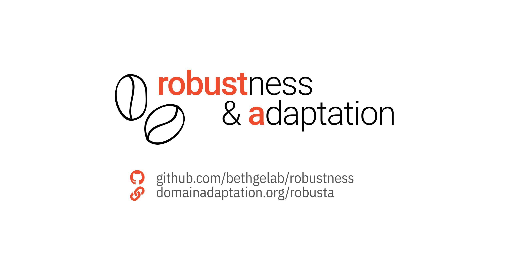

[](https://paperswithcode.com/sota/unsupervised-domain-adaptation-on-imagenet-c?p=adapting-imagenet-scale-models-to-complex)
[](https://paperswithcode.com/sota/unsupervised-domain-adaptation-on-imagenet-r?p=adapting-imagenet-scale-models-to-complex)
[](https://paperswithcode.com/sota/unsupervised-domain-adaptation-on-imagenet-a?p=adapting-imagenet-scale-models-to-complex)


# Robustness evaluation and Adaptation of ImageNet models

This repo contains a growing collection of helper functions, tools and methods for robustness evaluation and adaptation of ImageNet scale models.
The focus is on simple methods that work at scale.

We currently have the following features available:
- [`examples/batchnorm`](/examples/batchnorm): A reference implementation of batch norm adaptation used by Schneider, Rusak *et al.* (NeurIPS 2020)
- [`examples/selflearning`](/examples/selflearning): A reference implementation of self learning with robust pseudo labeling used by Rusak, Schneider *et al.* (arxiv 2021)
- [`examples/imagenet_d`](/examples/imagenet_d): Example runs on the ImageNet-D dataset used by Rusak, Schneider *et al.* (arxiv 2021)

Planned features for future releases are (please open an issue if you can think of additional interesting parts to add):
- Helper functions for robustness datasets like ImageNet-A, ImageNet-R and ImageNet-C
- [`examples/clip`](/examples/clip): Robustness evaluation for [CLIP](https://github.com/openai/CLIP.git), Radford *et al.* (2021)
- [`examples/dino`](/examples/dino): Robustness evaluation for [DINO](https://github.com/facebookresearch/dino), Caron *et al.* (2021)
    - Blog Post with robustness results: https://stes.io/dino/

## News

- May '21: We will present our work on self-learing as a contributed talk at the [WeaSuL 2021](https://weasul.github.io/) workshop at ICLR.
- April '21: The pre-print for "Adapting ImageNet-scale models to complex distribution shifts with self-learning" is now available on arXiv: arxiv.org/abs/2104.12928
- September 2020: The BatchNorm adaptation paper was accepted for poster presentation at NeurIPS 2020.
- July '20: A shorter  workshop version of the paper was accepted for oral presentation at the Uncertainty & Robustness in Deep Learning Workshop at ICML 2020.
- June '20: The pre-print for "Improving robustness against common corruptions by covariate shift adaptation" is available on arXiv: arxiv.org/abs/2006.16971.pdf

## ☕ The `robusta` toolbox for **Robust**ness and **A**daptation

### Motivation

Besides reference implementations, this repo is mainly intended to provide a quick and easy way to adapt your own code.
In particular, when developing new methods for improving robustness on deep learning models, we find it interesting to report results after *adapting* your model to the test datasets. This paints a more holistic image of model robustness: Some people might be interested in ad-hoc model performance, other might be interested in the performance obtained in a transductive inference setting.

Note that the package is not intended for general purpose domain adaptation. Instead, we focus on providing simple methods that prove to be effective for ImageNet scale model adaptation at test time. The package provides helper functions that are "minimally invasive" and can easily be added to existing source code for model evaluation.


### Quick Start

You can install the package by running

```bash
pip install robusta
```

Depending on your system setup, it can make sense to first manually install the correct `torch` and `torchvision`
versions as described on the [PyTorch website](https://pytorch.org).

Here is an example for how to use `robusta` for batchnorm adaptation & robust pseudo-labeling.

``` python
    model = torchvision.models.resnet50(pretrained=True)

    # We provide implementations for ImageNet-val, ImageNetC, ImageNetR,
    # ImageNetA and ImageNetD:
    val_dataset = robusta.datasets.imagenetc.ImageNetC(
        root=dataset_folder, corruption="gaussian_blur", severity=1,
        transform=transforms.Compose([transforms.ToTensor()])
        )
    val_loader = torch.utils.data.DataLoader(
        val_dataset, batch_size=batch_size, shuffle=True)

    # We offer different options for batch norm adaptation;
    # alternatives are "ema", "batch_wise_prior", ...
    robusta.batchnorm.adapt(model, adapt_type="batch_wise")

    # The accuracy metric can be specific to the dataset:
    # For example, ImageNet-R requires remapping into 200 classes.
    accuracy_metric = val_dataset.accuracy

    # You can also easily use self-learning in your model.
    # Self-learning adaptation can be combined with batch norm adaptation, example:
    parameters = robusta.selflearning.adapt(model, adapt_type="affine")
    optimizer = torch.optim.SGD(parameters, lr=1e-3)

    # You can choose from a set of adaptation losses (GCE, Entropy, ...)
    rpl_loss = robusta.selflearning.GeneralizedCrossEntropy(q=0.8)

    acc1_sum, acc5_sum, num_samples = 0., 0., 0.
    for epoch in range(num_epochs):
        predictions = []
        for images, targets in val_loader:

            logits = model(images)
            predictions = logits.argmax(dim=1)

            # Predictions are optional. If you do not specify them,
            # they will be computed within the loss function.
            loss = rpl_loss(logits, predictions)

            # When using self-learning, you need to add an additional optimizer
            # step in your evaluation loop.
            optimizer.zero_grad()
            loss.backward()
            optimizer.step()

            acc1_sum, acc5_sum += accuracy_metric(predictions, targets, topk=(1,5))
            num_samples += len(targets)
            print(f"Top-1: {acc1_sum/num_samples}, Top-5: {acc5_sum/num_samples}")
```


## Example Implementations

### Batch Norm Adaptation

[](https://paperswithcode.com/sota/unsupervised-domain-adaptation-on-imagenet-c?p=improving-robustness-against-common)
[](https://paperswithcode.com/sota/unsupervised-domain-adaptation-on-imagenet-r?p=improving-robustness-against-common)

[[Paper](https://arxiv.org/abs/2006.16971.pdf)] [[Web](https://domainadaptation.org/batchnorm)] [[README](examples/batchnorm/README.md)] [[Implementation](batchnorm/src/evaluate.py)]

We propose to go beyond the assumption of a single sample from the target domain when evaluating robustness. Re-computing BatchNorm statistics is a simple baseline algorithm for improving the corruption error up to 14% points over a wide range of models, when access to more than a single sample is possible.

### Self-Learning

[](https://paperswithcode.com/sota/unsupervised-domain-adaptation-on-imagenet-c?p=adapting-imagenet-scale-models-to-complex)
[](https://paperswithcode.com/sota/unsupervised-domain-adaptation-on-imagenet-r?p=adapting-imagenet-scale-models-to-complex)
[](https://paperswithcode.com/sota/unsupervised-domain-adaptation-on-imagenet-a?p=adapting-imagenet-scale-models-to-complex)

[[Paper](https://arxiv.org/abs/2104.12928)] [[Web](https://domainadaptation.org/selflearing)] [[README](examples/selflearning/README.md)] [[Implementation](selflearning/gce.py)]

Test-time adaptation with self-learning improves robustness of large-scale computer vision models on ImageNet-C, -R, and -A.

### Robustness evaluation of DINO models

[[Blog Post](https://stes.io/dino)] [[*Implementation coming soon*](examples/dino/README.md)]

## License

Unless noted otherwise, code in this repo is released under an [Apache 2.0](/LICENSE) license. Some parts of the implementation use third party code. We typically indicate this in the file header or in the methods directly, and include the original license in the [NOTICE](/NOTICE) file.

This repo does not contain the full code-base used in [Rusak, Schneider et al. (2021)](https://domainadaptation.org/selflearing) and is instead currently limited to a reference re-implementation for robust-pseudo labeling and entropy minimization. A full version of the codebase might be independently released in the future.

If you want to use part of this code commercially, please carefully check the involved parts. Part of the third-party implementations might be released under licences with a non-commercial use clause such as CC-NC. If in doubt, please reach out.

## Contact

Please reach out for feature requests. Contributions welcome!

- [Steffen Schneider](https://stes.io)
- [Evgenia Rusak](https://github.com/EvgeniaAR)
- [George Pachitariu](https://github.com/georgepachitariu)


*Note: The current version of this code base is a work in progress. We still decided to do this pre-release since the core methods are conceptually easy to use in your own code (batch norm adaptation, self-learning, ... and the current state might already be a useful place to start.*
